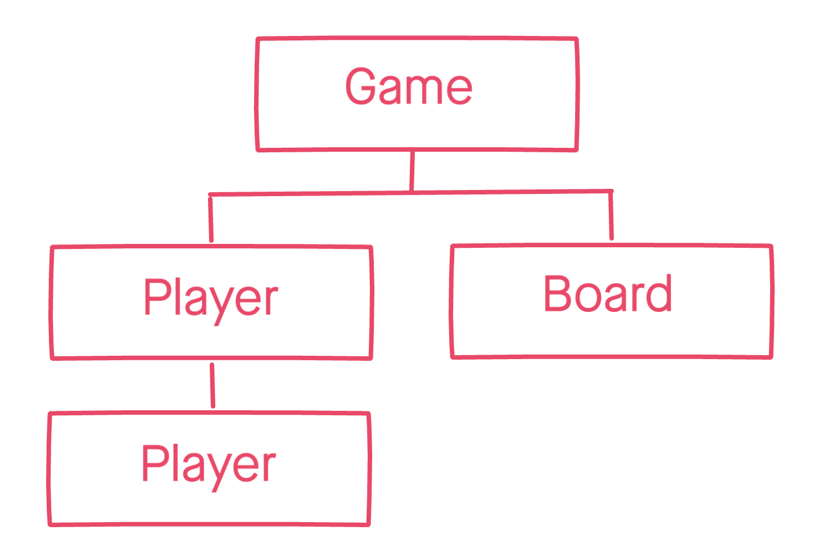

### [Makers Academy](http://www.makersacademy.com) - Tech test

# Tic-Tac-Toe ❌⭕

#### Technologies: Javascript, Jasmine

[Task](#Task) | [Specifications](#Specifications) | [Data Structure](#Data_structure) | [Domain Model](#Domain_model)

## <a name="Task">The Task</a>

This is a very common tech test as it demonstrates a candidate's knowledge of basic data structures.

## <a name="Specifications">Specifications</a>

The rules of tic-tac-toe are as follows:

* There are two players in the game (X and O)
* Players take turns until the game is over
* A player can claim a field if it is not already taken
* A turn ends when a player claims a field
* A player wins if they claim all the fields in a row, column or diagonal
* A game is over if a player wins
* A game is over when all fields are taken

Build the business logic for a game of tic tac toe. It should be easy to implement a working game of tic tac toe by combining your code with any user interface, whether web or command line. 

## <a name="Data_structure">Data Structure</a>

The tic-tac-toe board can be represented as a multidimensional array:

| [0][0] | [0][1] | [0][2] |
| ------ | ------ | ------ | 
| [1][0] | [1][1] | [1][2] |
| [2][0] | [2][1] | [2][2] |

## <a name="Domain_model">Domain Model</a>

